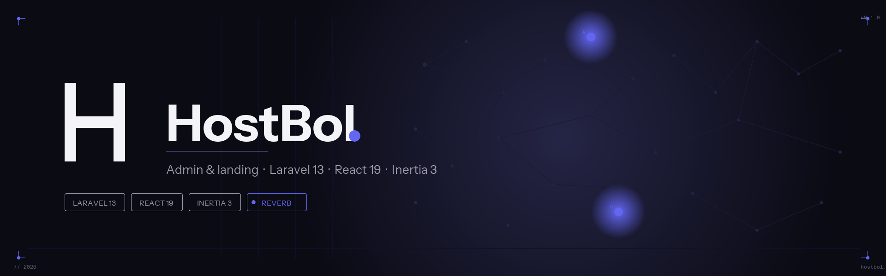

# HostBol



Panel de administración y landing pública para **HostBol**, construida como una SPA moderna con Laravel 13 + Inertia 3 + React 19.

---

## Stack

| Capa            | Tecnología                                                  |
| --------------- | ----------------------------------------------------------- |
| Backend         | PHP 8.3 · Laravel 13                                        |
| Frontend        | React 19 · Inertia 3 · Vite 8 · Tailwind CSS 4              |
| Auth            | Laravel Fortify (2FA + passkeys)                            |
| Realtime        | Laravel Reverb (Echo)                                       |
| Permisos        | Spatie `laravel-permission` + `laravel-medialibrary`        |
| Rutas tipadas   | Laravel Wayfinder                                           |
| Calidad         | Pint · PHPStan level 7 · ESLint · Prettier · Pest           |
| Default DB      | SQLite (en memoria para tests)                              |

---

## Requisitos

- PHP **8.3+** con extensiones estándar de Laravel
- Composer 2
- Node.js 20+ y npm
- Extensión `pdo_sqlite` (o el driver de tu DB preferida)

---

## Instalación rápida

```bash
composer setup          # clona .env, genera key, migra, npm install, npm run build
composer dev            # arranca server + queue + pail + vite en una sola consola
```

Si en tu entorno `npm install` salta silenciosamente las devDependencies (por `NODE_ENV=production` o `npm config get omit` devolviendo `dev`), usá:

```bash
npm install --include=dev
```

Esto es necesario porque vite, eslint, prettier, typescript y `@laravel/vite-plugin-wayfinder` son devDependencies.

---

## Decisiones de arquitectura

- **HTTP / routing**: `bootstrap/app.php` usa el estilo `Application::configure` de Laravel 11+. El middleware termina con `HandleAppearance`, `HandleInertiaRequests` y `AddLinkHeadersForPreloadedAssets`.
- **Frontend entry**: `resources/js/app.tsx`. Las páginas viven en `resources/js/pages/` y se montan vía Inertia.
- **Wayfinder**: agregar rutas Laravel primero (en `routes/web.php` o `routes/settings.php`); las bindings tipadas se regeneran en `resources/js/{actions,routes,wayfinder}/` al correr `npm run dev` / `npm run build`.
- **Auth**: Fortify maneja login, 2FA y passkeys. Las vistas viven en `resources/js/pages/auth/`.
- **Realtime**: Reverb expuesto vía `php artisan reverb:start`. El cliente usa `@laravel/echo-react`.
- **Permisos**: Spatie `laravel-permission` con roles y permisos, gestionados en `/admin/roles`.
- **Media**: Spatie `laravel-medialibrary`, con UI en `/admin/media` y picker reutilizable (`media/media-picker-dialog.tsx`, `media-picker-dialog.tsx`).
- **Migraciones**: prefijo `YYYY_MM_DD_HHMMSS_` desde 2026. **No normalizar** a `0001_*`.

---

## Deploy / producción

`ecosystem.config.cjs` define dos procesos PM2. **No los arranques con `php artisan` en prod**:

| Proceso            | Comando                                                                  |
| ------------------ | ------------------------------------------------------------------------ |
| `hostbol-reverb`   | `php artisan reverb:start --host=0.0.0.0 --port=0000`                   |
| `hostbol-queue`    | `php artisan queue:work --tries=3 --timeout=180`                          |

- Logs en `storage/logs/pm2/`.
- Artefactos del build en `public/build/`.
- `VITE_APP_NAME` se lee en build time y queda horneado en el bundle del cliente.

---

## Variables de entorno

`.env.example` trae:

```
DB_CONNECTION=sqlite
SESSION_DRIVER=database
CACHE_STORE=database
QUEUE_CONNECTION=database
BROADCAST_CONNECTION=log
```

---

## Licencia

MIT.